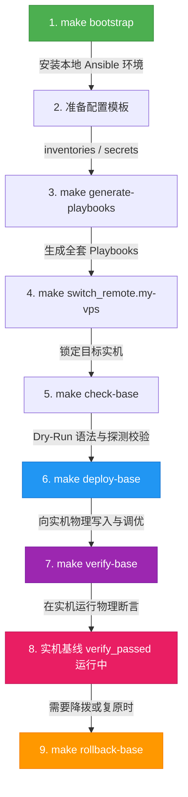

# 🌌 AuroraOps Base

[](https://docs.ansible.com/)
[](https://www.debian.org/)
[](LICENSE)
[](https://github.com/suainam/auroraops-base)

> [!NOTE]
> **AuroraOps Base** 是企业级 Debian (12 Bookworm / 13 Trixie) VPS/服务器自动化管理框架的基础首装套件。
> 它旨在帮助您仅通过一份代码库和极简的配置模板，在一台全新、干净的 Linux 服务器上实现顶级的系统调优、存储优化、网络接入与极致的安全加固。

---

## 🗺️ 架构与生命周期工作流

以下是 AuroraOps 完整的“本地控制端 ➔ 远端托管机”部署与物理断言验证的工作流程。



---

## 🛠️ 核心功能与 18 个系统角色

本仓库包含了以下高度集成的系统与个性化运维角色，按 Phase 执行序列编排：

### 🟢 阶段 0：核心系统底层 (Phase 0)
*   **`init`**: 物理包索引更新、基础环境依赖包安装、全局主机名配置。
*   **`base`**: 系统时区（软链接与配置）、字符编码生成、高性能国内 APT 镜像源管理、NTP systemd-timesyncd 客户端及公共 DNS 服务调优。
*   **`sysctl`**: 网络高并发、TCP 拥堵算法 (BBR/BBR2)、内存换入换出率 (Swappiness)、系统最大文件 watches 监控数等内核级参数调优。
*   **`limits`**: 突破文件描述符限制，将用户 soft/hard nofile 上限提升至 `1048576`。
*   **`swap`**: 识别物理内存并自动生成/缩放合理大小的高速 Swap 交换分区。
*   **`zram`**: 内存压缩，智能为低配 VPS 提供 RAM 水平的动态内存缓冲。
*   **`journald`**: 优化 Systemd Journal 日志，持久化存储并严格约束最大容量。
*   **`systemd_priority`**: 动态优化系统关键核心服务（SSH, PostgreSQL 等）的 nice 与 OOM 分数映射。

### 🟢 阶段 1：网络与主机安全加固 (Phase 1)
*   **`ssh`**: 物理禁用 SSH 密码登录（仅密钥认证）、修改 SSH 端口、屏蔽 Root 密码登录，并启用连接通道复用。
*   **`firewall`**: 基于 UFW 的安全防火墙，默认入站全拦截，仅开启业务提权端口。
*   **`fail2ban`**: 实时审计系统日志，动态屏蔽恶意扫描与爆破 SSH 的外部恶意 IP。
*   **`logrotate`**: 全局日志轮转编排，定时裁剪并防范日志写满磁盘。
*   **`unattended_upgrades`**: 自动化安全补丁守护进程，定时自动拉取并修复 Linux 安全漏配。

### 🟢 阶段 2：组网与本地个性化 (Phase 2 & 2.5)
*   **`zerotier`**: 一键加入 ZeroTier 虚拟局域网。
*   **`user_management`**: 企业级多用户权限管控，隔离 Root 权限。
*   **`ansibletest`**: 仓库自带的自动化验证与单测框架。
*   **`benchmark`**: 系统综合性能测试底盘。
*   **`reinstall`**: 快速一键重装引导组件。

---

## ⚡ 极速上手指引

### 1. 本地初始化
在一台可以访问目标 VPS 的本地机器上，克隆仓库并初始化 Ansible 执行沙箱：
```bash
make bootstrap
make bootstrap-status   # 检查 Ansible 虚拟环境及 Mitogen 状态
```

### 2. 准备个性化模板
复制并填充您自己物理服务器的连接模板：
```bash
# 1. 复制物理机 Host 配置文件
cp inventories/prod.ini.example inventories/prod.ini

# 2. 复制主机变量模板 (将 example-host 命名为您在 prod.ini 中配置的别名)
mkdir -p inventories/host_vars
cp inventories/host_vars/example-host.yml inventories/host_vars/my-vps.yml

# 3. 复制公共变量与 Secrets 加密模板
cp inventories/group_vars/all/base.example.yml inventories/group_vars/all/base.yml
cp secrets/vault.yml.example secrets/vault.yml
```

### 3. 一键校验、生成与执行
```bash
make validate            # 静态代码及标签规范校验
make generate-playbooks  # 基于规则自动优化并编译全套 Playbooks
make switch_remote.my-vps # 锁定操作环境至 my-vps 远程主机
make env_show            # 确认当前的 target 锁定参数

# 执行标准三部曲
make check-base          # 1. Dry-Run 校验 (100% 模拟)
make deploy-base         # 2. 物理部署至远端实机 (修改系统配置)
make verify-base         # 3. 执行实机断言验证 (检查 udev, noatime, NTP 真实状态)
```

> [!TIP]
> **精确单角色操作**：支持通过点号语法只对单个系统角色执行生命周期：
> ```bash
> make check-base.swap
> make deploy-base.firewall
> make verify-base.ssh
> make rollback-base.zram
> ```

---

## 🔒 状态化生命周期与实机验证断言

AuroraOps 区别于普通的 Ansible 脚本，采用了**严格状态化的生命周期管理**：

1.  **事实基线记录 (facts.d)**：
    当一个角色开始 `deploy` 时，会在远端主机 `/etc/ansible/facts.d/<role_name>.fact` 中持久化记录该主机的原始（Pre-deploy）系统配置（例如原 sources.list、原 locale、原时区）。
2.  **物理断言验证**：
    `verify` 命令在实机上执行严密的主机状态读取。例如 `verify-base` 会拷贝并调用 `/root/AuroraOps/scripts/verify_phase0.py` 脚本，提取物理参数进行 assert（例如判断当前 `sda` 设备激活的调度算法是否确为 `[bfq]`）。
3.  **零污染优雅回滚**：
    执行 `rollback` 阶段时，Ansible 会从实机读取原生的 `.fact` 快照，将时区、 locale、 sources.list、挂载选项等完美恢复为**您部署前的纯净模样**，并物理清理所有的临时脚本和配置，确保主机无任何残留垃圾。

---

## ⚠️ Mitogen 运行兼容性与测试提示

> [!WARNING]
> **新版本 Python 3.12 + Ansible 2.21 兼容性说明**：
> - 全局默认使用 `strategy = mitogen_linear`（配置在 `ansible.cfg` 中）能在物理部署中提供**极致的连接提速与性能倍增**。
> - 但由于 Ansible 2.21+ 的内部 API 升级，Mitogen 0.3.x 在执行带有 `register` 注册或 `ansible.builtin.setup` 的系统探测任务时，在 dry-run (check) 模式下有概率抛出 `UnifiedTaskResult is not iterable` 的崩溃异常。
>
> **💡 官方最佳隔离方案**：
> 1. **本地开发/实机部署**：请继续在物理机器部署中使用默认策略以享受极致的部署性能。
> 2. **Docker 验收测试沙箱**：在干净容器中跑 remote acceptance 验收测试时，脚本中会自动通过 `-e ANSIBLE_STRATEGY=linear` 注入策略变量，将容器内隔离运行于原生流水线模式（`pipelining = True`），彻底规避第三方插件冲突，确保 100% 验收率。

---

## 🤝 贡献与安全合规

我们致力于为开源世界提供最干净、最安全的运维底座。在向本仓库贡献代码时，请严格遵守安全审计守则：
- ❌ **严禁携带任何私密凭据**：禁止硬编码任何 SSH 密钥、物理 IP 地址、真实数据库密码或 decrypted 文本进入仓库中。
- 🔍 **发布前强制审计**：建议在推送至公开仓库前，运行内置审计工具：
  ```bash
  python3 scripts/audit_public_split.py --profile auroraops-base --output-root /tmp/auroraops-public-audit --write-report
  ```
